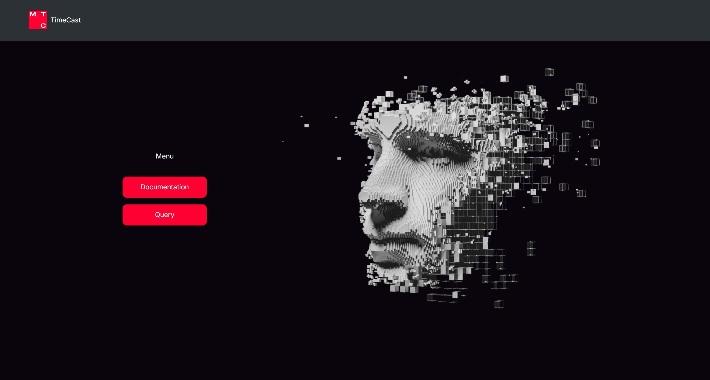
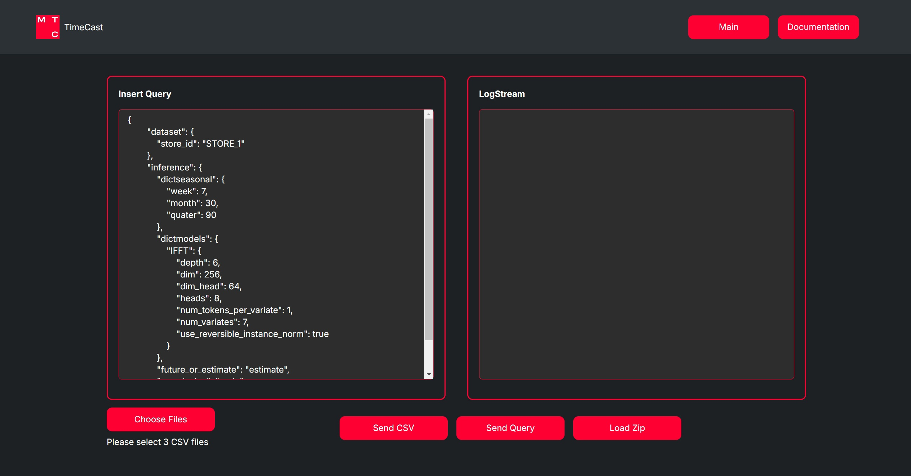
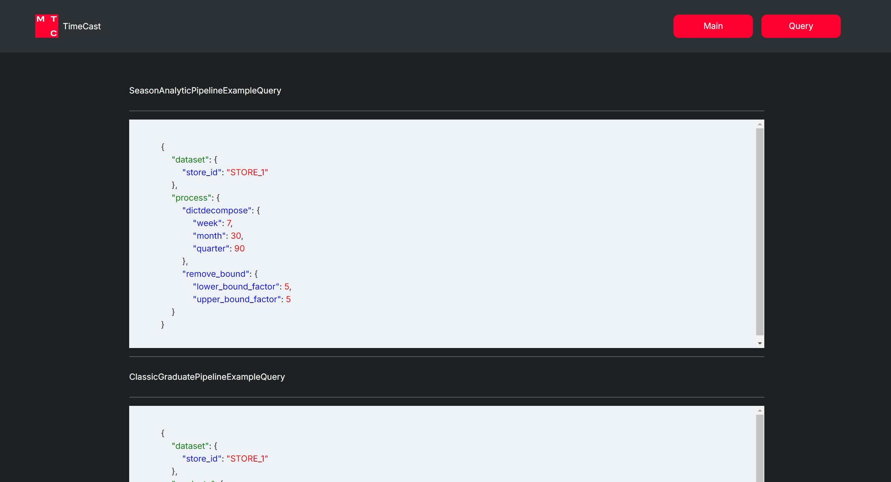

# 

|  | <a href="https://git.io/typing-svg"></a> |
|-----------------------------------------------------------------------|--------------------------------------------------------------------------------------------------------------------------------------------------------------------------------------------------------------------------------------------------------|


---

✨ Описание проекта ✨

---

> Каждый репозиторий на GitHub — это не просто код, это отражение чьего-то видения,
> идеи и стремления к совершенству. Проект на GitHub — это живой организм,
> который эволюционирует, учится и растет.

---


### Внешний вид графического интерфейса на React:

|  |  |  |
|------------------------------|--------------------------------|------------------------------|


Презентация проекта находится [**Пока не здесь**](src/images/UIBOT.pdf)


- [Структура репозитория](#структура-репозитория)
- [Необходимые требования](#требования)
- [Установка и настройка](#установка-и-настройка)
  - [Установка виртуальной среды и зависимостей](#1-установка-виртуальной-среды-и-зависимостей)
    - [Linux server](#linuxmacos)
    - [Windows server](#windows)
  - [Запуск тестов](#2-запуск-тестов)
    - [Linux server](#linuxmacos-1)
    - [Windows server](#windows-1)


 ## Структура репозитория

```
    .
    ├── logs # - папка храенения логов
    |   ├── setup #
    |   |   ├── *.log #
    |   └── app.log #
    ├── setup - кастомный установщик среды
    |   ├── check_local_modules.py - проверка локальных модулей
    |   ├── debug_info.py - вывод информации
    |   ├── setup_common.py
    |   ├── setup_windows.py - установочное меню
    |   └── validate_requirements.py - валидация модулей
    ├── src
    |   ├── database - база данных
    |   |   ├── models.py - модели
    |   |   └── my_connector.py - класс для подключения к базе данных
    |   ├── images - статические файлы
    |   ├── pipeline - пайплайны
    |   |   ├── server.py - uvicorn сервер
    |   |   └── test.py - тесты CRUD операций
    |   ├── repository - репозитории
    |   |   └── ...
    |   ├── scripts - скрипты
    |   ├── service - сервисы
    |   |   └── ...
    |   ├── utils
    |   |   ├── custom_logging.py - кастомный лог
    |   |   ├── exam_services.py - проверка на дубликаты
    |   |   ├── hashing.py - хеширование паролей
    |   |   ├── return_url_object.py - скрипт для формирования ссылок на изображения
    |   |   ├── write_file_into_server.py - запись файлов на сервер
    |   |   └── ...
    ├── venv # - виртуальная среда
    ├── .env # - переменные среды
    ├── .gitignore
    ├── create_sql.py - скрипт для авто создания и заполнения базы данных
    ├── env.py - скрипт для работы с переменными средами
    ├── main.bat - запуск сервера на windows
    ├── main.sh - запуск сервера на linux
    ├── TimeCase.sql - sql скрипт для создания базы данных
    ├── requirements.txt - список зависимостей
    ├── requirements_external.txt - дополнительныйсписок зависимостей
    ├── setup.bat - установка среды на windows
    ├── setup.log # - файл лога
    └── setup.sh - установка среды на linux
```


### Реляционная база данных:


  ## Требования
- Python 3.9+ 
- `pm2` (для управления процессами сервера на Linux/MacOS)


 ## Установка и настройка

### 1. Установка виртуальной среды и зависимостей

#### Linux/MacOS

* Клонируйте репозиторий на сервер:
    ```bash
    git clone https://github.com/Prischli-Drink-Coffee/TimeCast.git
    cd repo
    ```
* Запустите скрипт для установки виртуальной среды и всех необходимых зависимостей:
    ```bash
    bash setup.sh
    ```

* Следуйте инструкциям в консоли для установки пакетов

#### Windows

* Клонируйте репозиторий на сервер:
    ```cmd
    git clone https://github.com/Prischli-Drink-Coffee/TimeCast.git
    cd repo
    ```

* Запустите скрипт для установки виртуальной среды и всех необходимых зависимостей:
    ```cmd
    setup.bat
    ```
* Следуйте инструкциям в консоли для установки пакетов


### 2. Запуск сервера

* Запустите скрипт через pm2 для Linux/MacOS
    ```bash
    pm2 start 'bash pm2.sh'
    ```
* Запустите через меню выбора для Linux/MacOS
    ```bash
    main.sh # пункт 3 в меню
    ```
* Запустите скрипт для запуска сервера на Windows
    ```cmd
    main.bat # пункт 3 в меню
    ```


### 3. Запуск тестов CRUD операций базы данных

Для запуска автоматической проверки тестов с использованием `pytest`, выполните:
```bash
bash test_main.sh
   ```

Для запуска автоматической проверки тестов с использованием `pytest`, выполните:
```cmd
 test_main.bat
   ```

Сервер можно запустить локально или в веб-пространстве, тогда вы получите доступ к пользовательскому интерфейсу, для настройки сервера достаточно указать переменные среды в таком формате:

UPLOAD_DIR=./public <br/>
DATA_PATH=./public/data <br/>
PLOTS_PATH=./public/plots <br/>
ZIP_PATH=./public/zip <br/>
WEIGHTS_CLASSIC_PATH=./src/weights_classic <br/>
WEIGHTS_NEIRO_PATH=./src/weights_neiro <br/>
HOST=localhost <br/>
SERVER_PORT=8080 <br/>
DB_HOST=127.0.0.1 <br/>
DB=TimeCast <br/>
DB_PORT=3306 <br/>
DB_USER=root <br/>
DB_PASSWORD= <br/>
DEBUG=FALSE <br/>
OFF_DATABASE=TRUE <br/>
